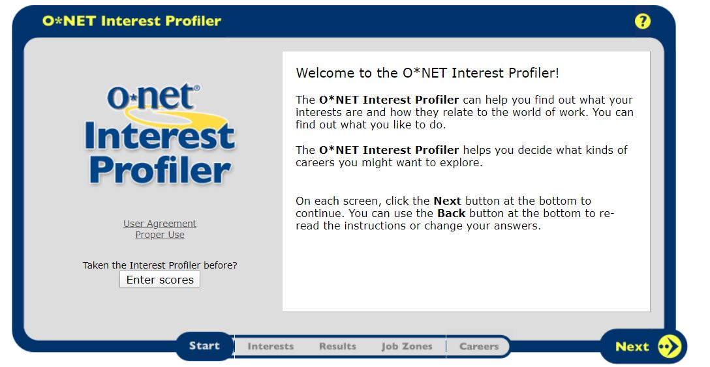
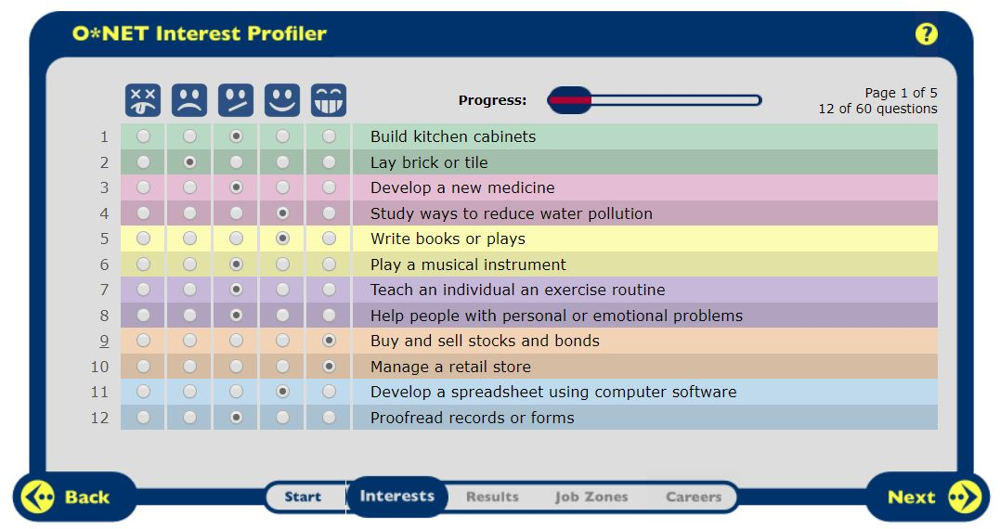
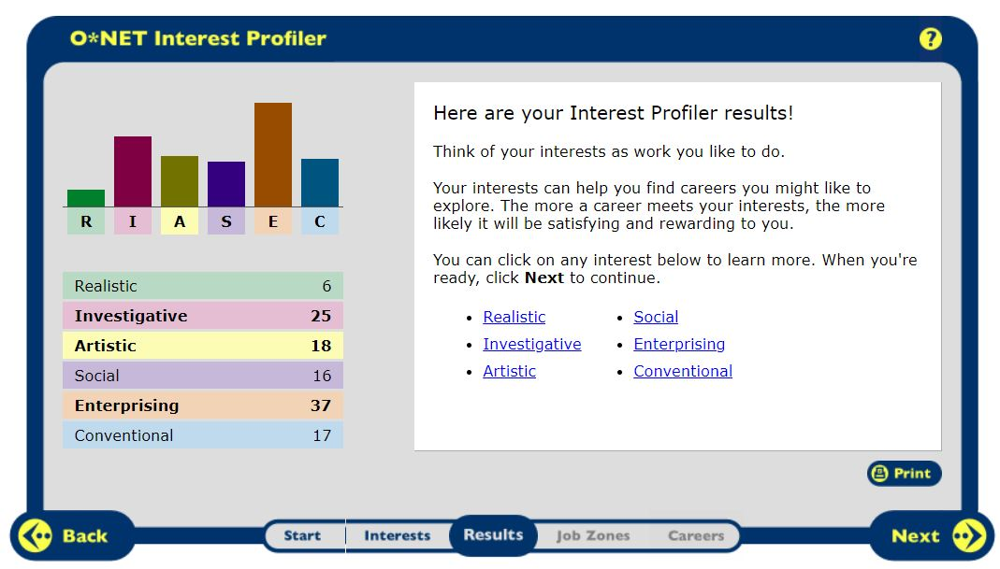
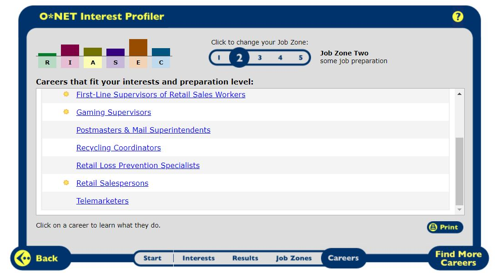
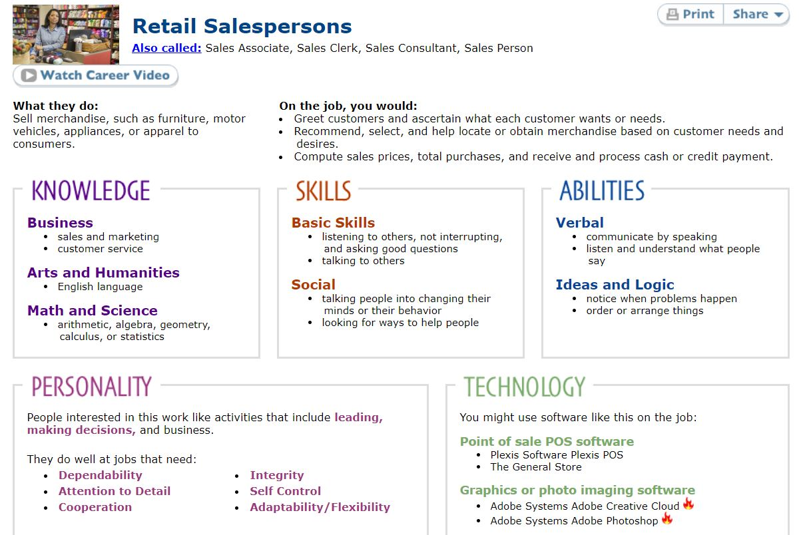
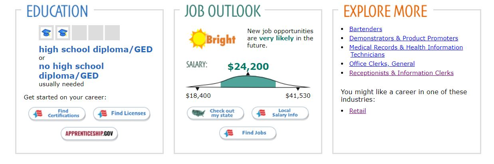
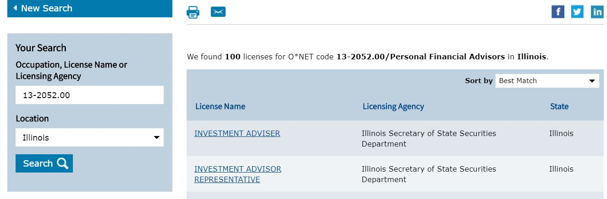
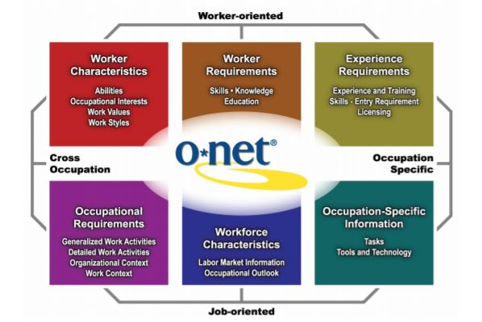

As a public policy student and someone who is generally interested in how society adapts to new technology, I am interested in what a lot of people call “the future of work,” particularly as it relates to career training and matching for populations that are currently underserved by our educational systems. Recently, I dove into research on occupational task automation. I noticed that along with predictions about whether and when jobs will be automated by algorithms was substantial handwringing about the anxiety that career destabilization was causing for workers.

I became curious about whether career search platforms offer anything practical to allay these anxieties. Do they identify skill training opportunities to workers in high-automation-risk roles? Can they recommend new jobs that are more likely to see stability, or even growth, in the medium to long term? For many of the major platforms, like Monster and Indeed, the answer is no.

However, I came across the O`*`NET My Next Move Interest Profiler web app on the United States Department of Labor’s (DOL) <a href="https://www.mynextmove.org/"> My Next Move website</a>> The Interest Profiler attempts to take on some of these challenges by allowing users to interact with curated DOL data through an interest assessment. It uses results from a questionnaire to recommend occupations to users based on their interests. It’s actually one of several web-based tools built on public data on from the DOL’s O`*`NET database. Moreover, as a digital product based on public data and sponsored by the US government about 20 years ago, the Interest Profiler represents a very early example of federal civic technology.

I’m a huge civic tech nerd, so naturally I explored the tool and researched to find as much information about its creation as I could. I discovered that while the tool is deeply flawed, as any two-decade-old product is bound to be, it is still very successful in many ways. Thinking about how job seekers decide on their careers today, I realized that there might even be an opportunity to redesign the product for a contemporary user.

But I’m getting ahead of myself. Let’s first see how the Interest Profiler works.

<h3>The Product</h3>

Upon reaching the website, the user is greeted with an introduction to the tool that provides an explanation about what it does and who it’s for. Users are told that they’re about to answer 60 questions that will help them decide which career path is right for them.

Once the user clicks through 4 text-heavy pages, they reach the first of five pages with 12-questions each. Users are prompted to rate different occupational tasks on a scale of 1-5 based on how much they enjoy, or think they would enjoy, doing them. Here’s a sample of some of the activities: “Teach an individual an exercise routine;” “Inventory supplies using a hand-held computer;” and “Assemble electronic parts.” At this point, I'm not entirely sure how the results will reflect my answers to these questions.

Once the user completes all 60 questions, the user is presented with their score (apparently, I’m “enterprising,” “investigative” and “artistic”).

After clicking through more pages of explanation, the user is instructed to decide how much education or training they are willing to undertake in their job search. The Interest Profiler then provides the user with career recommendations based on the results from the assessment and the user’s reported desire to pursue additional training.

Users can scroll through the list of several dozen occupations and click on any of them to see detailed information about a job. Jobs that are projected by the Bureau of Labor Statistics (BLS) to experience high demand in the coming years are marked with sun-shaped icons. An explanation of their methodology is provided <a href="https://www.mynextmove.org/help/about/">here</a>.

There are, unsurprisingly, a lot of careers available for exploration in the DOL’s data portal; over 900, actually! Even when the user chooses to view a list of all careers, the Interest Profiler application still helpfully arranges the list by highlighting “Best fit” occupations.

Clicking on an occupation, such as “Retail Salesperson”, directs the user out to another web page that displays a detailed description of the job, lists of required skills and day-to-day tasks. From a user’s perspective, learning that retail salespeople should have strong listening skills might be very helpful for someone unsure of what skills to work on developing.

From this new page, the user can also view education and training requirements for the occupation, salary information and similar occupations. Each of the sections that present this information contain links to more pages with maps that break down hiring trends geographically and links to occupational certification programs.  

A user considering a career as a Personal Financial Advisor, which does require special certification, is able to search for training programs nearby where they can earn required certifications within their zip code.

The Interest Profiler is built to be the starting point in a job seeker’s journey. It leverages public data to empower job seekers who know they want to make a change, but don’t know where to start to see all of the career options available to them. Moreover, it’s free, which makes the tool available to anyone who needs it.

Despite the Interest Profiler’s antiquated look, it tries to solve a real pain point for job seekers—not knowing what occupations fit one’s interests—that isn’t addressed by many other job search products. However, I think there are several missed opportunities with the tool to successfully solve user problems and align with DOL organizational goals.

<h3>Interest Profiler Hits and Misses</h3>

At the most foundational level, a well-designed product must create value for users while accomplishing the objectives of its creators.

Does the Interest Profiler create sufficient value for users? Yes and no. According to the O`*`NET My Next Move website, “My Next Move is an interactive tool for job seekers and students to learn more about their career options.” The Interest Profiler’s core user is likely a student who does not have access to high-quality career counseling resources at their school, or a career-changer who is unsatisfied with their current occupation and unsure about what to do next.

The Interest Profiler does satisfy a largely unmet need for its core users. The well-known job search websites—Indeed, LinkedIn, Monster—are thick marketplaces for jobs, but offer little aid to users who don’t know what industries or roles to search for. Individuals who are just starting their career searches might be able to get advice from parents or guidance counselors, but these resources are limited. Besides the Interest Profiler (and a similar, more expensive tool called <a href="https://www.myplan.com/" >My Plan</a>), there are few ways for someone who does not already have a relationship with someone knowledgeable about career opportunities to see the full range of paths open to them.

Usability, however, is an issue. As you might have noticed from the screenshots, My Next Move and the Interest Profiler look dated. The tool is extremely lacking from a UX perspective and the assessment results are difficult to interpret.

First of all, My Next Move’s website is not mobile responsive and is nearly impossible to use on a smartphone. This isn’t just an aesthetic issue. According to <a href="https://www.pewresearch.org/internet/fact-sheet/mobile/">Pew Research</a>, approximately 18% of all Americans do not use broadband internet at home, but do own smartphones and primarly connect to internet through public WiFi. This group includes mostly low-income households and represents a core market for the Interest Profiler. By failing to accommodate these users, the tool’s creators sharply reduce their solution’s potential reach and impact.

Regardless of how one accesses the tool, it can be confusing to navigate because of unintuitive UI design choices. The user interface is extremely text-heavy, assumes users understand several undefined industry-specific terms and requires users to click through almost a dozen pages of small buttons and explanation. In addition to being time-consuming to navigate, The Interest Profiler’s results pages are a data-dump that overwhelm users with a mountains of information. There is very little information that is effectively synthesized and contextualized, and little to no interactivity.

It’s also unclear how indicating (dis)interest in activities like “[Raising] fish in a fish hatchery” affects the outcomes of the assessment. While the specific assessment is <a href="https://www.researchgate.net/publication/232495923_Holland's_RIASEC_Model_as_an_Integrative_Framework_for_Individual_Differences">based on research by J.L Holland</a>, the relationship between these questions and career recommendations is hard to understand from the user’s perspective.

Another missed opportunity is that users don’t have the ability to create an account to save and share their results. For users who work infrequently with a school guidance counselor or social worker, this feature could serve as a valuable, low-cost communication mechanism.

Finally, assessment results do not take into account recent research on automation of occupational tasks. My personal Interest Profiler assessment results suggested that I should consider careers in telemarketing or cashiering, despite <a href="https://www.oxfordmartin.ox.ac.uk/downloads/academic/The_Future_of_Employment.pdf">credible predictions</a> that they are likely to be automated in the relatively near future.

A 2010 National Academy of Sciences report on O`*`NET identifies some of these issues and correctly recommends that the DOL implement: “(1) navigation across websites, (2) user-centered design, and (3) interactivity” in order to improve usability. As far as I can tell, few of these recommendations have been implemented. Despite UX issues, is the Interest Profiler successful from an organizational standpoint for DOL? Probably, but it could be improved.

O`*`NET and My Next Move were <a href="https://www.nap.edu/catalog/12814/a-database-for-a-changing-economy-review-of-the-occupational">developed under the sponsorship</a> of the U.S. Department of Labor/Employment and Training Administration (USDOL/ETA) through a grant to the North Carolina Department of Commerce in 1998. In order to assess whether the product was successful, it’s necessary to first understand how this tool fits into the DOL’s vision for O`*`NET and then what metrics are appropriate to evaluate success. The stated mission of O`*`NET is to:
“. . contribute to the more efficient functioning of the U.S. labor market by providing high quality job training, employment, labor market information, and income maintenance services primarily through state and local workforce development systems (U.S. Department of Labor, 2009)”

The Interest Profiler is one of several tools built on top of the O`*`NET database to assist with career education and job matching. This group of tools, which also includes a skill assessment, values assessment and others, is intended to support these workforce development initiatives. As a tool for helping job seekers identify new career interests, the Interest Profiler certainly aligns with this mission.

Despite usability issues, as of the 2010 study, the tool still received impressive traffic. “O`*`NET OnLine received 766,000 visitors per month in 2008, or approximately 9.2 million visitors over the course of 2008 (Lewis and Rivkin, 2009a). These 9 million visitors carried out 10.5 million searches and viewed more than 13 million occupational reports, translating to just over one search per visitor and one report per visitor (Lewis and Rivkin, 2009b).” These figures do not include the monthly userbase of the Interest Profiler, but there is no indication that the National Academy of Sciences panel was concerned with the popularity of this tool. Without collecting user feedback or measuring employment outcomes for users, it is difficult to say how beneficial the tool was to users’ job searches. Thus, while it appears that DOL is satisfied with the Interest Profiler's metrics, it still may not be having the desired impact.

<h3>What Would a Better Interest Profiler Look Like?</h3>

There is room for substantial improvement along two axes: focus on user needs and alignment with organizational goals. The review panel that published the 2010 report and DOL identified four key workforce development goals in their 2010 report that O`*`NET data and tools are specifically intended to address:

<ol>
  <li>Defining critical occupations for economic and workforce development for national, state, and regional areas. This includes defining clusters of occupations relevant to policy, program, or research initiatives, such as high-skill, high-demand occupations; science, technology, engineering, and mathematics occupations; career pathways; green jobs; etc.</li>
  <li>Developing skill transferability and worker assessment tools for use in placing adults in jobs, rapid response to layoffs, and supporting economic development.</li>
  <li>Identifying appropriate education and training options for displaced and transitioning workers.</li>
  <li>Assisting employers in human resource management activities, including employee recruitment, retention, and development.</li>
</ol>

Of these, the Interest Profiler is most clearly suited to solve the problems presented in objective `#3`. A rebuilt Interest Profiler could focus on enabling job seekers who have been displaced from their jobs—particularly those who have lost their jobs due to automation or other labor market trends—to find new careers that match their interests and have promising outlooks in light of contemporary research into automation and the “future of work.”

From a user perspective, more could also be done to offer guidance on where and how to acquire relevant skills beyond listing out training programs and certifications. As someone who has already spent quite a bit of time throughout graduate school discovering my own career interests, I know first-hand just how difficult and overwhelming it is to find a long-term career path that matches my interests, skills and values.  

Solving user flow and design issues in the Interest Profiler is, of course, also key to empowering users in their job searches. It goes without saying that the entire site would benefit from adopting many of the web design best practices that are commonplace today. I would also question whether basing the Profiler’s assessment on Holland’s assessment is the best way of using interests to recommend occupations to job seekers.

Additionally, the results page would be much more understandable and easier for users to navigate if there were more opportunities for users to interact with the O*NET data. After completing the assessment, users are recommended about two dozen occupations from a list of over 900. For each occupation, users are presented with required skills, technologies used, salary data, licensing requirements and a lot more all at once. However, users cannot compare different jobs side by side and the results they do receive are difficult to process.

Including more robust data visualization elements and interactive features that allow users to choose which categories of data to view would make the assessment results much easier to interpret. These features can be built with existing O`*`NET data and would unlock a lot of value from the O`*`NET database for users.

Finally, a redesigned Interest Profiler could include a feature that lets users share their results with a guidance counselor or social worker. Right now, users can share their results on social media, but it’s hard to see when this would be useful. A “share with career coach” feature would enable the Interest Profiler to more effectively function as a tool that enhances the job seeker-career coach relationship and workflow.

There are already a lot of tools out there for job seekers who know which career they want to pursue. However, there are relatively few options for individuals who don’t know what they want to do. The pain is particularly acute for people who are just beginning their careers or want to make a career change and need actionable advice to get them started. Such resources exist, but they’re often prohibitively expensive. The Interest Profiler attempts to fill this gap but falls short of success in a number of ways.

My goal over the coming months is to build a redesigned Interest Profiler using O`*`NET data. I’m going to write about my experience and showcase my work every step of the way, from customer discovery to development. I hope you’ll follow along!  
