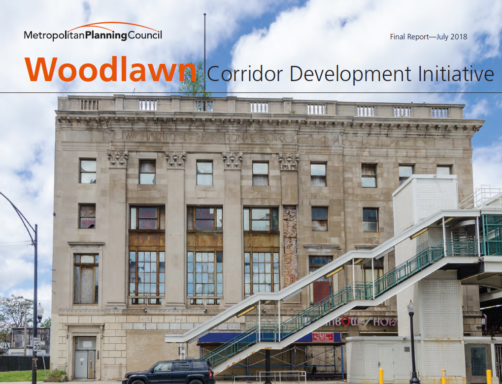
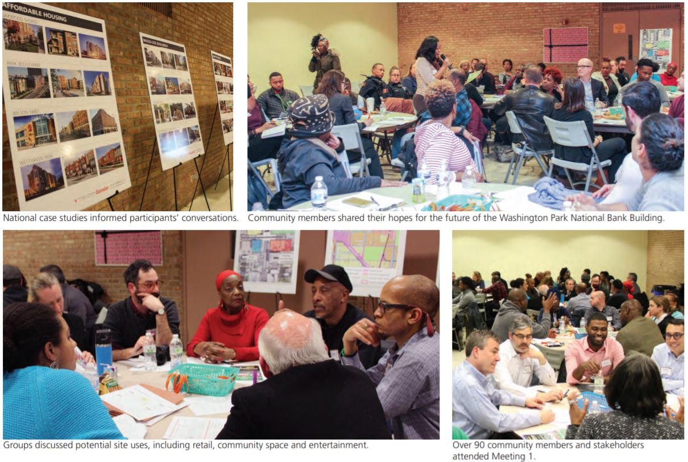
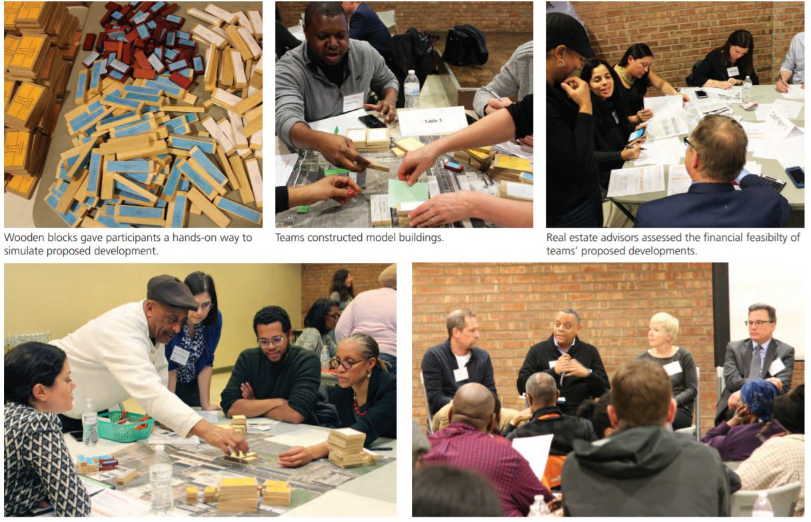

<h3>The Problem</h3>

The residents of Woodlawn had a problem. In their entire neighborhood of 24,000 people, there is only 1 sit-down restaurant, 1 dance club and not a single bank. Just two generations earlier, Woodlawn was America’s “Black Mecca”—a hub of jazz clubs, retail and other businesses that brought renown and prosperity to Chicago’s South Side. Today, racist policies and disinvestment have inflicted staggering population loss and poverty on the neighborhood, leaving its once-vibrant main street mostly vacant.

The Cook County Land Bank Authority (CCLBA) had a solution in mind to spark reinvestment in Woodlawn’s failing main street. The CCLBA had recently acquired a 4-story vacant building—a historic bank—in a tax auction. Rather than immediately sell the property off to the highest bidder, they wanted to involve the community in the property disposition process. However, the CCLBA had never overseen such a complex community engagement process before and needed help with planning and execution.

<h3>The Plan</h3>

At Metropolitan Planning Council (MPC), we believed that we could simultaneously revitalize Woodlawn’s main street and also empower residents to participate in the reconstruction of a neighborhood that has been beset upon by real estate speculators ever since the announcement that the Obama Presidential Center would be built just a mile away. To achieve this, we proposed a process to the CCLBA whereby we would convene hundreds of residents and local nonprofit organizations to jointly establish priorities for development. Community discussion would occur over the course of two months, including three public meetings and online postings.

These were not going to be any ordinary community meetings. To be successful, we had to empower all stakeholders to lend their voices to the process, which meant a far more substantive community outreach process than the typical community hearing, where only a handful of highly engaged individuals participate. Moreover, we planned to involve community members in a collaborative design sprint process to flesh out their visions for the future development.

We made sure that all of this extra effort would pay off. At the conclusion of meetings and feasibility analysis, the CCLBA promised to incorporate the community’s priorities directly into the Request for Proposals (RFP) as requirements that the future developer would be obligated to uphold. If successful, our partnership with CCLBA would enable us to give residents power that they never had before possessed—to have a direct hand in the development of their community.

<i>Outreach</i>

From the beginning, we know that stakeholder trust would be the biggest hurdle we would face. The people of Woodlawn have a healthy distrust of CCLBA and other city agencies that we hoped would support our initiative. Despite their sincere interest in revitalizing Woodlawn, Cook County and the City of Chicago had for years been accustomed to making policy decisions behind closed doors that favored North Side neighborhoods at the expense of the South Side. Where it mattered the most, Woodlawn residents were left with the short straw and disempowered to instigate for change.

We discovered that many community leaders were not interested in participating in public meetings either. They had been subjected to more than a few community engagement projects that demanded their precious time and promised change, but had never delivered results. Any community outreach that we ran would have to overcome years of built-up distrust and resentment just to bring everyone to the table. As a neutral party with no formal ties to the city, county or private developers, we were in a unique position to do that.

We pursued two tactics in parallel. First, I identified all major institutions and community associations that had a meaningful stake in the redevelopment of this property and invited their leaders to join MPC, CCLBA and city representatives to ask questions and discuss concerns about the process.

Second, I hit the streets. From talking to community leaders, I learned that analogue communication would be far more effective at getting the word out than social media or online postings. Within two days, I visited every school, business, church, YMCA and resident association office in Woodlawn to distribute informational fliers. While it would have been cheaper to rely on standard digital communication tools, we felt it was vital to reach as many people as possible.

<i>Design Sprints</i>

The community meetings we held were organized as a design sprint covering 6 weeks and including 250+ residents. Over three two-hour long meetings, we facilitated group discussions to define the problem statement, brainstorm and prototype developments, and reach consensus on community priorities.

Urban planning and real estate are difficult topics to understand, which is partly why non-experts often find it intimidating to participate in typical public hearing processes. To help participants overcome this barrier, we started each off with a short educational presentation. For example, at the beginning of the second meeting I presented on financial tradeoffs in real estate development in order to prompt participants to consider these as they brainstormed ideas.

After setting the stage with a Q&A between residents and city and country representatives and by discussing neighborhood issues in small groups, residents were invited to participate in a hands-on design activity. Groups of 8 community members built models of their preferred developments using 3x3 foot scale maps and hundreds of color-coded wooden blocks that we made for the sprint. The tools they were given allowed them to specify the uses for the building, how much parking it would have (if any), and whether it would include subsidized affordable housing. Participants could also add comments to describe other desired attributes that they could not express with their blocks.

Once a group finished their design, they summarized their ideas on a piece of paper and an architect volunteer sitting at their table sketched up a rendering of their idea. After all the tables completed designs, we collected the papers and brought them back to the office. What we did next was vital to making participants really feel like their input in this process mattered.

In between the second and third community meetings, I took each summary sheet and converted information from the design exercise (numbers of different blocks, types of commercial tenants, affordability) into a financial model that I built. The model converted block types into building square footages and calculated estimated rates of return and financing shortfalls. We also gave the stack of sketches to an architecture firm that agreed to volunteer for us to clean up and turn into computer-generated renderings.

When we returned to the meeting hall two weeks later, we had every community-generated idea printed up on foam boards and a slide deck highlighting themes and metrics from the whole exercise. We presented these to the community and hosted a Q&A with participants, local developers and small business lenders. The discussion focused primarily on the tradeoffs that development teams would need to make between various design elements in order to produce a feasible project.

After the final meeting concluded, every participant was invited to vote for their favorite development and indicate their opinions on the tradeoffs discussed earlier. These results were aggregated into a report that summarized community priorities. After participants received the report with time to offer comments, we sent the community’s recommendations to the CCLBA, who integrated them directly into their RFP document.

<h3>What Went Well</h3>
 

<i>Facilitation</i>

We brought as many stakeholders as possible to the table and facilitated an authentic community engagement process. It cannot be overstated how vital it was to have city and county representatives at the meetings willing to answer tough questions posed by residents.

<i>Design sprint</i>

The design sprints provided us with a nuanced articulation of community desires while remaining inclusive to all participants. People really enjoy hands-on activities and it made a lot of very esoteric concepts like zoning laws and density maximums approachable.

<i>Week over week participation</i>

We were able to maintain a 50%+ return rate for participants, which I see as a positive indication that people who came bought into the process and felt it was worthwhile to see it through. Getting 45 people to attend three 90-minute meetings (not to mention the 150+ that attended 1 or 2 meetings) is no easy task and I’m proud of the work the team did to maintain outreach and facilitate dialogue.

<h3>What Could be Improved</h3>

<i>Non-resident participation</i>

About 20% of the participants each week were not Woodlawn residents. Naturally, public meetings at this scale draw wide public interest, but we were still concerned that the presence of outsiders would make residents doubt the legitimacy of the process. While we asked at every available opportunity for non-residents to refrain from participating in design exercises and voting, there is always the possibility that they influenced the outcome. If I could do it over, I would do something like creating color-coded nametags to provide greater transparency to participants about who was a Woodlawn resident.

<i>Online disengagement</i>

Attempts to engage with residents through online channels—e.g. newsletters, social media—were unsuccessful. Online surveys sent out by nonprofits we were collaborating with in their weekly emails received only a couple dozen responses over a month. I can think of two reasons why this happened. First, it could be that our messaging didn’t communicate well enough to residents why participation would be worth their time. Relatedly, even if residents knew the value of expressing their priorities in a survey like ours, they probably didn’t know what MPC is and didn’t trust us to follow through on the promises we made.

<h3>Key Takeaways</h3>

Leading this program taught me important lessons about using participatory design to drive organizational strategy, as well as project management and stakeholder management. To solicit honest, authentic feedback from “end-users” or constituents, it is essential to set expectations about what outcome their input will (and won’t) contribute to as early as possible and continuously communicate these expectations. In parallel, maintain open channels feedback channels to gather questions and criticism that can be used to improve the process. Following through on these two activities

Managing a multi-week project with a large number of contributing teams and partners, especially when some of the contributors are also external stakeholders, is challenging. In addition to maintaining frequent, clear communication between teams, doing a “pre-mortem” where the team leads identified all possible issues helped us catch problems early and ultimately made this project successful. If I could do it again, I would spend more time up front explicitly identifying dependencies, which would have made completing some of the very time-sensitive deliverables less frantic.

Since the process concluded, I’ve heard about drama unfolding between CCLBA and the Woodlawn community around a private developer’s desire to demolish the historic bank structure despite the wishes of the community expressed in the RFP. This goes to show that without commitment from key decision makers from beginning to end, even the most inclusive participatory design process may not achieve the right outcomes.  
